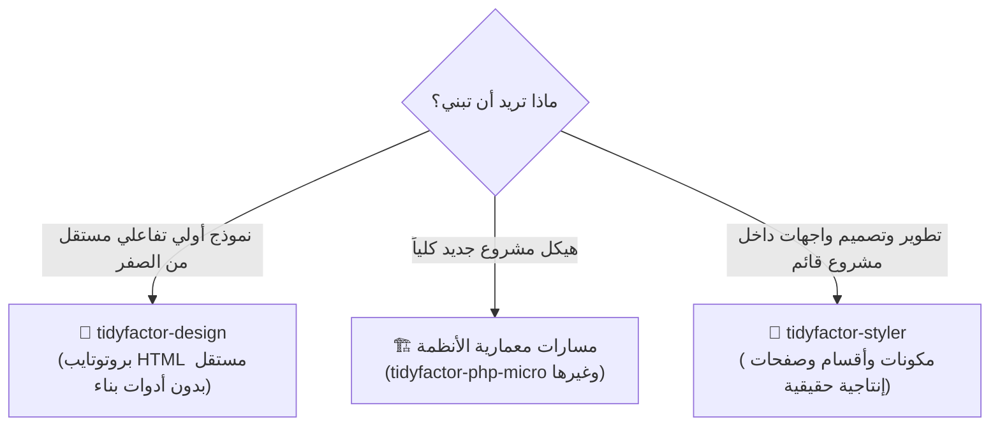

<div align="center" dir="rtl">

# 💎 مهارة تايتفكتور ستايلر `TidyFactor Styler v1.1.1`
### حزمة هندسة الواجهات، وطبقة القرارات السياقية (CDL)، والتصميم الإنتاجي داخل المشاريع القائمة

**المهارة الرسمية المعتمدة لتصميم وهندسة الواجهات الإنتاجية عبر كافة أطر العمل الحديثة ضمن منظومة TidyFactor.**

[](https://www.npmjs.com/package/@alwkala/tidyfactor-styler)
[](LICENSE)
[](README.ar.md)
[](#-معايير-مكافحة-التصميم-المبتذل-anti-slop-وجودة-المخرجات)
[-green.svg?style=for-the-badge)](#-الترخيص-وحوكمة-المعايير)

[✨ موقع الوكالة](https://alwkala.com) • [⚡ سجل الأوامر الـ 13](#-سجل-أوامر-التصميم-الـ-12-command-registry) • [🛠️ مسارات العمل الـ 8](#%EF%B8%8F-مسارات-العمل-الإنتاجية-الـ-7-production-workflows) • [🌐 أطر العمل المدعومة](#-أطر-العمل-والبيئات-المدعومة) • [🇸🇦 هندسة الـ RTL](#-منظومة-دعم-اللغة-العربية-والاتجاه-rtl-الأصيل) • [📖 English Version](README.md)

</div>

---

> [!NOTE]
> **TidyFactor Styler** هي مهارة ذكاء اصطناعي (AI Agent Skill) ومحرك تصميم إنتاجي للوكلاء الأذكياء (*Google Antigravity, Claude Code, Cursor, Codex, Windsurf*) والمطورين، مصممة للعمل **مباشرة داخل مشاريع الكود الحقيقية والقائمة** (*Next.js / React, PHP, WordPress, HTML/CSS*). على عكس أدوات النماذج الأولية المعزولة، لا تخترع هذه المهارة معمارية خاصة بها، بل تلتزم بالكامل بأنماط المشروع، وتمنع تضارب الكلاسات والانحراف البصري (Zero Style Drift).

---

## 🌟 لماذا TidyFactor Styler؟ القيمة المضافة



| لمطوري الواجهات (Frontend) | لفرق التطوير والوكالات الرقمية | لوكلاء الذكاء الاصطناعي (AI Agents) |
|---|---|---|
| **الانسجام دون منافسة**: تتبنى كلاسات Tailwind وإعدادات المشروع الحالية ولا تنشئ طبقة CSS موازية أو متضاربة. | **مرونة شاملة لكل الـ Stacks**: الانتقال بسلاسة بين Next.js, PHP, WordPress بدون الحاجة لتوجيه يدوي معقد. | **توجيه موفر لسياق الذاكرة**: ملف `SKILL.md` خفيف جداً (~350 Tokens) يمنع حشو الذاكرة ويستدعي الملفات عند الحاجة فقط. |
| **دقة النطاق المعزول**: تعديل المكون يمس تعريفه واستخداماته فقط دون المساس بالمكونات المجاورة لتفادي الـ Regressions. | **عربية و RTL أصلية**: تحويل فوري للخصائص المنطقية (`ms-*`, `pe-*`, `start-*`) ومعايرة دقيقة لحجم خطوط Cairo و Tajawal. | **مكافحة التصميم المبتذل (Anti-Slop)**: نقد ذاتي قبلي على 6 محاور (P, H, E, S, R, V) يمنع الأنماط المتكررة والتدرجات البنفسجية الرخيصة. |
| **مصفوفة الحالات الثمانية (8-States)**: ضمان بناء كافة حالات التفاعل (Default, Hover, Active, Focus, Disabled, Loading, Empty, Error). | **مصدر الحقيقة للهوية (SSOT)**: قراءة `brand.json` وربطه المباشر بمتغيرات CSS Tokens داخل إعدادات المشروع. | **قوائم فحص صارمة**: كل مسار عمل ينتهي بقائمة تحقق إجرائية محددة للتأكد من اكتمال العمل قبل تسليمه. |

---

## ⚡ سجل أوامر التصميم الـ 12 (Command Registry)

تعتمد المهارة على جدول توجيه دقيق يضم **12 أمراً مخصصاً** ينقلك فوراً للهدف المطلوب:

| الأمر | الغرض ونية الاستخدام | ما يتم تحميله في الذاكرة | الناتج والقيمة العملية |
|---|---|---|---|
| `component` | "صمم / أعد تصميم هذا المكون" | `workflows/component-create.md` أو `component-redesign.md` + `component-anatomy.md` + مكدس التقنية | مكون إنتاجي تفاعلي بكافة حالاته الثمانية ومتغيرات CVA. |
| `section` | "صمم / نسق هذا القسم" | `workflows/section-create.md` أو `section-redesign.md` + `layout-archetypes.md` + `nav-footer-catalog.md` | قسم متناسق بتباعدات إيقاعية واستجابة شاشات مثالية. |
| `page` | "ابنِ صفحة إنتاجية جديدة" | `workflows/page-create.md` + `layout-archetypes.md` + `nav-footer-catalog.md` + مكدس التقنية | صفحة متكاملة مبنية وفق اتفاقيات وبنية مسارات المشروع. |
| `redesign` | "أعد تصميم هذه الصفحة القائمة" | `workflows/page-redesign.md` + `layout-archetypes.md` + `nav-footer-catalog.md` + `quality-bar.md` | تجديد بصري وتفاعلي شامل بدون كسر أي وظيفة أو مسار بيانات. |
| `layout` | "اختر الهيكل الإنشائي للصفحة" | `memory/layout-archetypes.md` + مكدس التقنية | اختيار 1 من 8 هياكل إنشائية كبرى (`editorial`, `interface`, `spatial`, إلخ). |
| `nav-footer` | "اختر قالب الهيدر والفوتر" | `memory/nav-footer-catalog.md` + `typography-arabic.md` + `rtl-css-engineering.md` | اختيار قوالب N1–N9 للهيدر و Ft1–Ft8 للفوتر مع دعم RTL كامل. |
| `typography` | "ضبط وتنسيق منظومة الخطوط" | `memory/typography-arabic.md` | تطبيق 7 مسارات تناغم للخطوط العربية واللاتينية (Cairo, Tajawal, El Messiri, Inter). |
| `palette` | "استخراج لوحة الألوان وفحص التباين" | `memory/brand-tokens.md` + `memory/asset-tooling.md` | توليد درجات ألوان متوافقة مع معايير إمكانية الوصول WCAG 2.1 AA. |
| `assets` | "تحسين وضغط الصور والأصول" | `memory/asset-tooling.md` + `memory/quality-bar.md` | فحص أبعاد الصور، ضغط الأصول، وتفريغ الخلفيات عبر أدوات بايثون مدمجة. |
| `rtl` | "فحص وتصحيح الاتجاهات والـ RTL" | `workflows/rtl-audit-fix.md` + `memory/rtl-css-engineering.md` | استبدال الكلاسات المطلقة بخصائص منطقية وتصحيح انعكاس الأيقونات. |
| `motion` | "إضافة وضبط الحركات والمؤثرات" | `memory/motion-principles.md` | هندسة مؤثرات متناسقة باستخدام Framer Motion أو Alpine مع مراعاة A11y. |
| `styles` | "تحديد الاتجاه أو النمط البصري" | `memory/design-styles.md` | توجيه الهوية البصرية لنمط محدد (Modern SaaS, Editorial, Swiss, إلخ). |

---

## 🛠️ مسارات العمل الإنتاجية الـ 7 (Production Workflows)

كل مهمة تصميمية تتبع مساراً صارماً من خطوة الصفر حتى الفحص النهائي:

1. **`component-create.md`**: قراءة التصميم والمكدس $\rightarrow$ تحديد المتغيرات والحالات $\rightarrow$ التنفيذ البرمجي $\rightarrow$ النقد الذاتي $\rightarrow$ الفحص.
2. **`component-redesign.md`**: فحص الوضع الحالي $\rightarrow$ تحديد الهدف والأسلوب $\rightarrow$ إعادة البناء بنطاق معزول $\rightarrow$ التحقق من عدم حدوث Regression.
3. **`section-create.md`**: موائمة الهيكل العام $\rightarrow$ ضبط إيقاع التباعد $\rightarrow$ توزيع المكونات $\rightarrow$ إتقان الاستجابة للموبايل.
4. **`section-redesign.md`**: عزل نطاق القسم $\rightarrow$ ترقية التسلسل الهرمي $\rightarrow$ تجديد العنصر البصري الجاذب $\rightarrow$ فحص الشاشات.
5. **`page-create.md`**: اختيار نمط الصفحة $\rightarrow$ ربط الهيدر والفوتر $\rightarrow$ تجميع الأقسام $\rightarrow$ حقن وسوم الـ SEO والميتاداتا.
6. **`page-redesign.md`**: توحيد الهوية البصرية $\rightarrow$ تحسين مسار التحويل $\rightarrow$ ضبط تناغم الخطوط $\rightarrow$ تدقيق ميزانية الأداء.
7. **`rtl-audit-fix.md`**: إزالة كلاسات الاتجاهات الثابتة $\rightarrow$ التحويل للخصائص المنطقية $\rightarrow$ تصحيح اتجاه الأيقونات $\rightarrow$ موازنة الخطوط.

---

## 🌐 أطر العمل والبيئات المدعومة

تتعرف المهارة تلقائياً على بنية مشروعك وتنفذ الكود بالمعايير الأصلية للبيئة:

| إطار العمل المستهدف | محرك التنسيق (Styling) | معمارية المكونات | محرك الحركات والمؤثرات |
|---|---|---|---|
| **React / Next.js** (App Router & Pages) | Tailwind CSS v4 / v3 أو CSS Modules | Radix UI / shadcn/ui + CVA + `clsx` + `tailwind-merge` | Framer Motion (`framer-motion`) |
| **PHP (TidyFactor / Flight / Medoo)** | Tailwind CSS أو متغيرات CSS Custom Properties | Semantic HTML5 Partials (Plates / Blade / PHP Views) | Alpine.js (`x-transition`) أو CSS Transitions |
| **WordPress / Classic CMS** | Modern Theme CSS / Gutenberg Styles | قوالب PHP Template Parts ومكعبات الكتل | Native CSS Keyframes / Vanilla JS |
| **Static HTML / CSS / JS** | Semantic CSS / Modern CSS Variables | كتل ومكعبات HTML5 القياسية | Vanilla JS / CSS Transitions |

---

## 🇸🇦 منظومة دعم اللغة العربية والاتجاه (RTL) الأصيل

تم بناء المهارة بواسطة مهندسي تصميم عرب، ولذلك فإن المحتوى العربي يعامل كأساس أصيل:

- **معيار الخصائص المنطقية (Logical Properties)**: استبدال 100% لكلاسات الاتجاهات القديمة (`left`, `right`, `pl-*`, `mr-*`) بكلاسات منطقية حيادية الاتجاه (`ps-*`, `pe-*`, `ms-*`, `me-*`, `start-*`, `end-*`).
- **معايرة الخطوط العربية**: الالتزام الصارم بقواعد الخطوط — العناوين تستخدم **El Messiri / Cairo / Rooyin**، والنصوص تستخدم **Tajawal / Cairo / Inter**. منع استخدام خط الأميري (Amiri) للعناوين التي تزيد عن 24px منعاً باتاً.
- **ارتفاع السطر العربي (Line-Height)**: تطبيق مضاعف ارتفاع سطر $\ge 1.5\times$ لمنع تداخل الحروف وعلامات التشكيل.
- **عكس الأيقونات الذكي**: عكس الأيقونات ذات الدلالة الاتجاهية فقط (الأسهم، أزرار التنقل، خطوات الترقيم)، مع تثبيت أيقونات الوسائط (التشغيل، الكاميرا، الصوت).

---

## 🛡️ معايير مكافحة التصميم المبتذل (Anti-Slop) وجودة المخرجات

لمنع مخرجات الذكاء الاصطناعي الرديئة والمكررة، يخضع كل كود لنظام **التقييم الذاتي القبلي على 6 محاور**:

```
[Pre-Emit Self-Critique]
P (Purpose):       هل يحل هذا المكون الهدف الوظيفي الحقيقي المطلوب؟ (1-5)
H (Hierarchy):     هل يوجد تسلسل هرمي بصري واضح وعنصر جاذب رئيسي؟ (1-5)
E (Execution):     هل تم بناء كافة حالات التفاعل الثمانية بدقة؟ (1-5)
S (Stack Native):  هل يطابق الكود تسميات ومكتبات المشروع الحالي تماماً؟ (1-5)
R (RTL Ready):     هل التباعدات والأيقونات محايدة للاتجاه وصحيحة عربياً؟ (1-5)
V (Visual Soul):   هل يخلو التصميم من التدرجات البنفسجية الرخيصة والأنماط المبتذلة؟ (1-5)
المجموع الإجمالي: يجب أن يحقق 25/30 كحد أدنى قبل كتابة وتصدير الكود.
```

---

## 🚀 التثبيت والاستخدام

### 1. عبر أداة NPX مباشرة:

```bash
# تثبيت مهارة tidyfactor-styler في مجلد مشروعك الحالي
npx @alwkala/tidyfactor-styler add-skill
```

### 2. النسخ المباشر لمجلد مهارات الوكيل الذكي:

انسخ مجلد `tidyfactor-styler` إلى مجلد مهارات بيئة العمل الخاصة بك:
- **Google Antigravity:** `.agents/skills/tidyfactor-styler/`
- **Claude Code:** `.claude-skill/skills/tidyfactor-styler/`
- **Cursor / Windsurf / Codex:** `.agents/skills/tidyfactor-styler/`

---

## 🏛️ منهجية TidyFactor وحوكمة الامتثال (8/8 Pass)

حققت مهارة `tidyfactor-styler` نسبة امتثال **100% (8/8 علامات)** وفق معايير **TidyFactor Skill Architect**:

1. ✅ **انضباط التوجيه (Dispatcher Discipline)**: ملف `SKILL.md` يعمل كموجّه مسارات فقط بدون حشو.
2. ✅ **مسار واحد لكل نتيجة (One Workflow = One Outcome)**: 7 مسارات عمل محددة تنتهي بقوائم فحص.
3. ✅ **ذاكرة تشغيلية نقية (Operational Memory)**: نصوص تقنية وقواعد خالصة خالية من الإنشاء السردي.
4. ✅ **انعدام الهياكل الفارغة (No Empty Structures)**: لا توجد مجلدات وهمية أو فارغة.
5. ✅ **عزل الفلسفة عن الكود (Philosophy Isolation)**: فصل المعايير التشغيلية عن الخطابات الترويجية.
6. ✅ **نمو مدفوع بالمحفزات (Trigger-Justified Growth)**: إضافة الملفات بناءً على محفزات وظيفية دقيقة.
7. ✅ **حاجز مكافحة الابتذال (Anti-Slop Quality Bar)**: فحص ذاتي إلزامي عبر 6 محاور و 16 قاعدة جودة.
8. ✅ **تطابق البيئات المتعددة (Cross-Platform Parity)**: توافق كامل بين Antigravity و Claude و Cursor و Codex.

---

## 👨‍💻 معلومات المطور والجهة المطورة

- **الجهة المطورة:** [وكالة الوكالة الرقمية — Alwkala](https://alwkala.com)
- **المنظومة:** [منظومة TidyFactor للمعمارية والمهارات](https://tidyfactor.com)
- **المهندس المعماري الرئيسي:** وائل الصديق — Wael S. ([@waels](https://github.com/alwkala))
- **البريد الإلكتروني:** [hello@alwkala.com](mailto:hello@alwkala.com)
- **الدعم والاستفسارات:** [https://alwkala.com](https://alwkala.com)

---

## 📜 الترخيص وحوكمة المعايير

المهارة منشورة تحت **رخصة MIT**. جميع الحقوق محفوظة © 2026 [Alwkala](https://alwkala.com) / منظومة TidyFactor.


---

## 🏛️ معمارية منظومة TidyFactor

**منظومة TidyFactor** هي بيئة معمارية برمجية مفتوحة وحزم مهارات لوكلاء الذكاء الاصطناعي قائمة على الفصل التام للمسؤوليات عبر دورة حياة المنتجات:

```text
منظمة TidyFactor الرسمية (github.com/TidyFactor)
│
├── مهارات الحوكمة والجودة (Governance)
│   └── Skill-Architect ← الحوكمة والمنهجية      (محرك حوكمة وبناء وهندسة المهارات المعتمدة)
│
├── مهارات التصميم (Design Skills)
│   ├── Cinematic       ← التجربة البصرية المبهرة / Experience (صفحات هبوط سينمائية تفاعلية)
│   ├── Design          ← النماذج الأولية السريعة / Prototype  (محرك تصميم الواجهات التفاعلي)
│   └── Styler          ← التصميم الإنتاجي / Production        (مهندس تصميم الواجهات وضبط RTL)
│
├── مهارات التوثيق والمعرفة (Documentation)
│   └── Doc             ← التوثيق والأدلة المعتمدة / Docsify    (محرك بناء وتوليد التوثيق الشامل)
│
├── مهارات التطوير البرمجي (Development Skills)
│   ├── Next            ← منصات الساس متعددة المستأجرين / Multi-Tenant (Next.js 16 + Postgres RLS)
│   ├── HTML            ← المواقع الثابتة وسيو المحتوى / Static & SEO   (هياكل خفيفة وسريعة)
│   ├── HTMX            ← الواجهات التفاعلية الخفيفة / Hypermedia        (تفاعلات بدون جافاسكريبت معقدة)
│   ├── JS              ← تطبيقات الصفحة الواحدة بدون أطر / Vanilla SPA  (نماذج تفاعلية بـ ES Modules)
│   └── PHP             ← المنظومات المخدمية الحديثة / Server-Rendered  (مكونات حديثة وتطبيقات PHP 8)
│
└── مهارات النمو والتسويق (Growth Skills)
    └── Marketing       ← استراتيجيات النمو والمبيعات / Growth & SEO    (تسويق الاستجابة المباشرة)
```

### 💎 ثلاثي الواجهات الأمامية والتجربة (Frontend Triad)

```text
                TidyFactor
                    │
          ┌─────────┼─────────┐
          │         │         │
      Cinematic   Design    Styler
          │         │         │
       Experience Prototype Production
          │         │         │
       "Wow"      "Build"   "Ship"
```

### 📦 مصفوفة التكامل الشامل للمجتمع (المهارات الـ 11 الرسمية)

| المسار البرمجي | الفئة | مستودع GitHub | مهارة الوكيل | حزمة NPM |
| :--- | :--- | :--- | :--- | :--- |
| **Skill-Architect** | الحوكمة | [`TidyFactor/Skill-Architect`](https://github.com/TidyFactor/Skill-Architect) | `tidyfactor-skill-architect` | [`@alwkala/tidyfactor-skill-architect`](https://www.npmjs.com/package/@alwkala/tidyfactor-skill-architect) |
| **Cinematic** | التصميم | [`TidyFactor/Cinematic`](https://github.com/TidyFactor/Cinematic) | `tidyfactor-cinematic` | [`@alwkala/create-cinematic-kit`](https://www.npmjs.com/package/@alwkala/create-cinematic-kit) |
| **Design** | التصميم | [`TidyFactor/Design`](https://github.com/TidyFactor/Design) | `tidyfactor-design` | [`@alwkala/tidyfactor-design`](https://www.npmjs.com/package/@alwkala/tidyfactor-design) |
| **Styler** | التصميم | [`TidyFactor/Styler`](https://github.com/TidyFactor/Styler) | `tidyfactor-styler` | [`@alwkala/tidyfactor-styler`](https://www.npmjs.com/package/@alwkala/tidyfactor-styler) |
| **Doc** | التوثيق | [`TidyFactor/Doc`](https://github.com/TidyFactor/Doc) | `tidyfactor-doc` | [`@alwkala/tidyfactor-doc`](https://www.npmjs.com/package/@alwkala/tidyfactor-doc) |
| **Next** | التطوير | [`TidyFactor/Next`](https://github.com/TidyFactor/Next) | `tidyfactor-next` | [`@alwkala/tidyfactor-next`](https://www.npmjs.com/package/@alwkala/tidyfactor-next) |
| **HTML** | التطوير | [`TidyFactor/HTML`](https://github.com/TidyFactor/HTML) | `tidyfactor-html` | [`@alwkala/tidyfactor-html`](https://www.npmjs.com/package/@alwkala/tidyfactor-html) |
| **HTMX** | التطوير | [`TidyFactor/HTMX`](https://github.com/TidyFactor/HTMX) | `tidyfactor-htmx` | [`@alwkala/tidyfactor-htmx`](https://www.npmjs.com/package/@alwkala/tidyfactor-htmx) |
| **JS** | التطوير | [`TidyFactor/JS`](https://github.com/TidyFactor/JS) | `tidyfactor-js` | [`@alwkala/tidyfactor-js`](https://www.npmjs.com/package/@alwkala/tidyfactor-js) |
| **PHP** | التطوير | [`TidyFactor/PHP`](https://github.com/TidyFactor/PHP) | `tidyfactor-php` | [`@alwkala/tidyfactor-php`](https://www.npmjs.com/package/@alwkala/tidyfactor-php) |
| **Marketing** | النمو | [`TidyFactor/Marketing`](https://github.com/TidyFactor/Marketing) | `tidyfactor-marketing` | [`@alwkala/tidyfactor-marketing`](https://www.npmjs.com/package/@alwkala/tidyfactor-marketing) |

---

## 👨‍💻 المنظمة والتواصل والدعم

- 🌐 **الموقع الرسمي للمنظومة:** [https://tidyfactor.com/](https://tidyfactor.com/)
- 📚 **التوثيق الرسمي المعتمد:** [https://tidyfactor.com/documentation](https://tidyfactor.com/documentation)
- 🤝 **الشريك التقني الرسمي:** [الوكالة الرقمية Alwkala](https://alwkala.com/)
- 🐙 **منظمة GitHub الرسمية:** [github.com/TidyFactor](https://github.com/TidyFactor)
- 📧 **استفسارات الأعمال والشركات:** [hello@tidyfactor.com](mailto:hello@tidyfactor.com)
- 📱 **واتساب:** [+20 101 665 6899](https://wa.me/201016656899)
- 📞 **الهاتف:** +20 101 665 6899
- 📍 **المقر:** القاهرة، جمهورية مصر العربية

---

## 📜 الترخيص والمجتمع

مرخصة تحت رخصة **Apache License 2.0**. حقوق النشر محفوظة (c) 2026 لصالح [منظومة TidyFactor](https://tidyfactor.com) و[الوكالة الرقمية Alwkala](https://alwkala.com).
