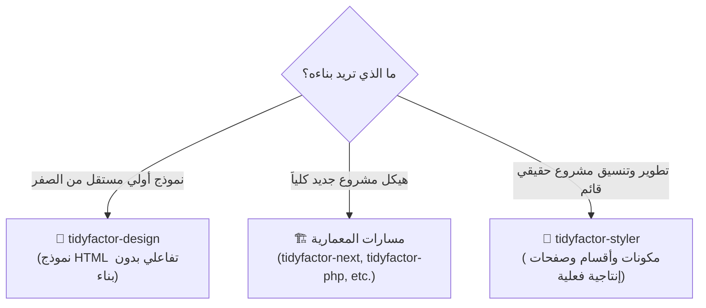
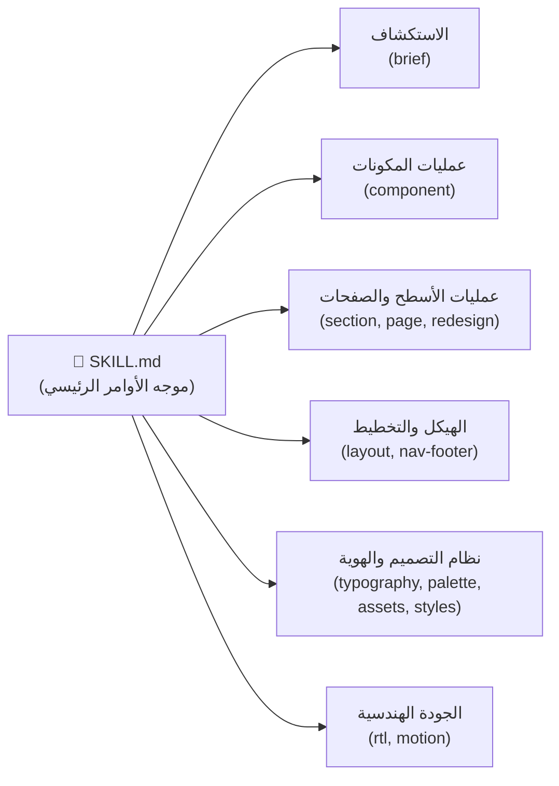

<div align="center" dir="rtl">

# 🎨 مهارة تايتفكتور لتنسيق أطر العمل `TidyFactor Styler v1.4.1`
### مهارة هندسة الواجهات البرمجية وتنسيق أطر العمل والتحويل الجراحي للـ RTL لوكلاء الذكاء الاصطناعي

امنح وكلاء البرمجة الذكية (**Google Antigravity و Claude Code و Cursor و OpenAI Codex و Windsurf**) محركاً هندسياً لتنسيق الواجهات يعمل مباشرة داخل مستودع مشروعك الفعلي — دون إنشاء طبقات أنماط مكررة، أو استيراد مكتبات غريبة، أو إحداث فوضى في ملفات الـ CSS.

[](https://www.npmjs.com/package/@tidyfactor/styler)
[](https://github.com/TidyFactor/Styler/stargazers)
[](LICENSE)
[](https://github.com/TidyFactor)
[](SKILL.md)
[](README.ar.md)
[-green.svg?style=for-the-badge)](#-منهجية-tidyfactor-وحوكمة-الامتثال)
[](SKILL.md)

[ English ](README.md) • [ العربية ](README.ar.md) • [ فارسی ](README.fa.md) • [ Español ](README.es.md) • [ Português ](README.pt.md) • [ 简体中文 ](README.zh.md) • [ Deutsch ](README.de.md) • [ Français ](README.fr.md)

<br/><br/>

<p align="center">
  
</p>

</div>

---

## 📚 جدول المحتويات

- [🎯 لماذا TidyFactor/Styler](#-لماذا-tidyfactorstyler)
- [🚀 البدء السريع](#-البدء-السريع)
- [🌟 القيمة المضافة: متى تستخدم Styler؟](#-القيمة-المضافة-متى-تستخدم-styler)
- [⚡ معمارية موجه الأوامر الـ 13](#-معمارية-موجه-الأوامر-الـ-13)
- [🛠️ مسارات العمل الإنتاجية الـ 8](#%EF%B8%8F-مسارات-العمل-الإنتاجية-الـ-8)
- [🌐 أطر العمل الإنتاجية المدعومة](#-أطر-العمل-الإنتاجية-المدعومة)
- [🇸🇦 هندسة اللغة العربية والتحويل الجراحي للـ RTL](#-هندسة-اللغة-العربية-والتحويل-الجراحي-للـ-rtl)
- [🛡️ حوكمة مكافحة العشوائية (Anti-Slop) وحاجز الجودة](#%EF%B8%8F-حوكمة-مكافحة-العشوائية-anti-slop-وحاجز-الجودة)
  - [1. مصفوفة النقد الذاتي سداسية المحاور (P, H, E, S, R, V)](#1-مصفوفة-النقد-الذاتي-سداسية-المحاور-p-h-e-s-r-v)
  - [2. مصفوفة حالات التفاعل الثمانية للمكونات](#2-مصفوفة-حالات-التفاعل-الثمانية-للمكونات)
- [❓ الأسئلة الشائعة (FAQ)](#-الأسئلة-الشائعة-faq)
- [🏛️ منظومة تايدي فاكتور الشاملة (TidyFactor Ecosystem)](#%EF%B8%8F-منظومة-تايدي-فاكتور-الشاملة-tidyfactor-ecosystem)
- [🏛️ منهجية TidyFactor وحوكمة الامتثال](#%EF%B8%8F-منهجية-tidyfactor-وحوكمة-الامتثال)
- [🤝 المساهمة والتطوير المجتمعي](#-المساهمة-والتطوير-المجتمعي)
- [👨‍💻 قنوات الدعم والتواصل](#-قنوات-الدعم-والتواصل)
- [📜 الترخيص](#-الترخيص)

---

## 🎯 لماذا TidyFactor/Styler

> [!IMPORTANT]
> **مانيفستو Styler: لماذا يُنتج الذكاء الاصطناعي واجهات باهتة وعشوائية؟**  
> تميل نماذج الذكاء الاصطناعي افتراضياً إلى المتوسط الإحصائي المكرر: تدرجات بنفسجية مبتذلة، غياب الحالات التفاعلية الدقيقة، تنسيقات Inline عشوائية، وتخريب الهوامش الاتجاهية (`mr-*` و `ml-*`) عند التحويل للغة العربية.  
> **مهارة TidyFactor Styler هي الترياق الهندسي الجراحي داخل كودك الحي:** تفرض عقداً برمجياً متوافقاً مع إطار عملك النشط، يُعيد تشطيب المكونات القائمة، يضبط تجربة الـ RTL باحترافية، ويحترم رموز التصميم المتبعة دون كسر معمارية التطبيق.

**تفرض TidyFactor/Styler مبدأ هندسياً صارماً: "التوافق لا التنافس (Conform, Don't Compete)":** تكتشف المهارة إطار العمل النشط في مشروعك، وتقرأ رموز التصميم الموجودة، وتولد مكونات متطابقة بنيوياً وكأن كبير مهندسي الواجهات في فريقك هو من كتبها.

| البُعد | التوليد التقليدي بالذكاء الاصطناعي | `tidyfactor-styler` |
|---|---|---|
| **بيئة التشغيل** | ملفات تجريبية معزولة أو مشاريع فارغة | **المشاريع الفعلية القائمة** (Next.js، PHP، WordPress، HTML) |
| **التوافق مع الأنماط** | حقن ملفات CSS جديدة أو طبقات Tailwind مكررة | **اعتماد إعدادات Tailwind الحالية** ومتغيرات CSS ونظام التسمية المتبع |
| **التحكم في النطاق** | تعديلات عشوائية قد تفسد الهيكل العام للصفحة | **تعديل جراحي محكوم النطاق** (المكون يعدل المكون واستخداماته فقط) |
| **دعم العربية والـ RTL** | عكس عشوائي وتخريب الهوامش الاتجاهية (`mr-*`, `left-*`) | **خصائص CSS المنطقية القياسية** (`ms-*`, `pe-*`, `start-*`) وموازنة الخطوط العربية |
| **جودة التصميم (Anti-Slop)** | تدرجات بنفسجية مكررة وغياب لحالات التفاعل | **نقد ذاتي سباعي المحاور (P, H, E, S, R, V, D)** + تغطية حتمية لحالات التفاعل الـ 8 |
| **استهلاك سياق الذكاء الاصطناعي** | نصوص طويلة غير منظمة تستهلك آلاف التوكنز | **موجه أوامر ذكي وخفيف** (~350 توكن عند البداية ويحمل الذاكرة عند الطلب) |

### ⚡ الفرق بين التوليد التقليدي وتشطيب Styler الجراحي (Before & After)

````carousel
```html
<!-- ❌ توليد الذكاء الاصطناعي التقليدي (عشوائي، قابل للكسر، واتجاه LTR قسري) -->
<button class="bg-purple-600 hover:bg-purple-700 text-white font-bold py-2 px-4 rounded mr-3 shadow-lg flex items-center gap-2">
  <span>Submit Order</span>
  <svg class="w-4 h-4 ml-1" fill="none" viewBox="0 0 24 24"><!-- سهم LTR ثابت --></svg>
</button>
<!-- العيوب: كلاس mr يخرب المحاذاة في RTL؛ تدرج بنفسجي عام؛ غياب لحالات التركيز والتحميل؛ يتجاهل نظام التصميم للمشروع -->
```
<!-- slide -->
```html
<!-- ✅ تشطيب TidyFactor Styler الجراحي (جاهز للإنتاج، متوافق مع رموز التصميم، وRTL أصيل) -->
<button class="btn-primary inline-flex items-center justify-center gap-2 font-medium transition-all duration-150 ease-out focus-visible:ring-2 focus-visible:ring-primary/40 focus-visible:outline-none disabled:opacity-50 disabled:pointer-events-none data-[state=loading]:cursor-wait data-[state=loading]:opacity-80 active:scale-[0.98] me-3">
  <span>تأكيد الطلب / Submit Order</span>
  <svg class="w-4 h-4 rtl:rotate-180 transition-transform" aria-hidden="true" viewBox="0 0 24 24"><!-- تدوير تلقائي في RTL --></svg>
</button>
<!-- المزايا: خصائص منطقية أصلية (me-3)؛ تدوير ذكي للأيقونة؛ تغطية كاملة لحالات التفاعل الـ 8؛ مقيد برموز التصميم النشطة -->
```
````


---

## 🚀 التثبيت والبدء السريع

اختر طريقة التثبيت المناسبة لمشروعك:

### الخيار (أ): عبر TidyFactor CLI الرسمي (الموصى به)
التثبيت الفوري دون الحاجة لتثبيت الأداة عالمياً في بيئة عملك النشطة:
```bash
npx @tidyfactor/cli add styler
```
*أو في حال كانت الأداة مثبتة لديك عالمياً (`npm i -g @tidyfactor/cli`):*
```bash
tidyfactor add styler
```

### الخيار (ب): عبر معيار مهارات الوكلاء المفتوح (skills.sh)
التثبيت العالمي المتوافق مع كافة بيئات الوكلاء ومحررات الذكاء الاصطناعي (Antigravity, Cursor, Claude Code, Windsurf, Codex):
```bash
npx skills add tidyfactor/styler
```

### الخيار (ج): التثبيت المباشر الفردي عبر NPM
تشغيل مثبت المهارة المستقل مباشرة مع تجاوز الذاكرة المخبأة وضمان أحدث إصدار:
```bash
npx @tidyfactor/styler@latest
```

### 2. مسارات التثبيت حسب بيئة الوكيل الذكي

| وكيل الذكاء الاصطناعي | مسار التثبيت في مساحة العمل |
|---|---|
| **Google Antigravity** | `.agents/skills/tidyfactor-styler/` أو الإعدادات العامة `~/.gemini/config/skills/` |
| **Claude Code** | `.claude-skill/skills/tidyfactor-styler/` |
| **Cursor / Codex / Windsurf** | `.agents/skills/tidyfactor-styler/` |

بمجرد التثبيت، اكتب `/brief` أو `/component` أو `/section` أو `/redesign` داخل نافذة المحادثة للبدء في هندسة الواجهات فوراً!

---

## 🌟 القيمة المضافة: متى تستخدم Styler؟



| لمطوري الواجهات (Frontend) | للشركات والفرق البرمجية | لوكلاء البرمجة الذكية (AI Agents) |
|---|---|---|
| **التوافق لا التنافس**: اعتماد نفس طريقة التسمية وإعدادات Tailwind دون إنشاء نظام CSS موازٍ. | **دعم شامل لكافة أطر العمل**: تنقل سلس بين Next.js و PHP و WordPress و HTML دون الحاجة لضبط يدوي للبرومبت. | **موجه فائق الخفة**: يستهلك موجه `SKILL.md` حوالي 350 توكن فقط عند البداية، ويستدعي الذاكرة عند الطلب. |
| **دقة محكومة النطاق**: تعديل المكون يمس تعريف المكون واستخداماته المباشرة فقط دون التأثير على العناصر المجاورة. | **العربية والـ RTL كأولوية قصوى**: خصائص CSS المنطقية (`ms-*`, `pe-*`, `start-*`) وموازنة ارتفاع الأسطر للأحرف العربية. | **حظر العشوائية (Anti-Slop)**: نقد ذاتي سداسي المحاور يمنع التدرجات البنفسجية الرخيصة والتصاميم الرديئة. |
| **مصفوفة تفاعل ثمانية الحالات**: ضمان تغطية كافة الحالات (الافتراضية، التحويم، التنشيط، التركيز، التعطيل، التحميل، الفارغة، والخطأ). | **التكامل مع هوية المشروع**: قراءة ملف `brand.json` تلقائياً وربط الألوان والرموز بمتغيرات المشروع. | **قوائم تحقق حتمية**: ينتهي كل مسار عمل بقائمة تحقق دقيقة قبل تسليم الكود. |

---

## ⚡ معمارية موجه الأوامر الـ 13

توفر `tidyfactor-styler` **13 أمراً تخصصياً دقيقاً** مقسمة هيكلياً:



| الأمر | نية واستخدام المطور | ما يتم تحميله في الذاكرة | المخرجات والقيمة |
|---|---|---|---|
| `brief` | "تثبيت موجز التصميم واختيارات المشروع" | `workflows/brief.md` + `memory/decision-points.md` | جلسة استكشافية سريعة لحفظ إطار العمل والمدرسة التصميمية. |
| `component` | "إنشاء / إعادة تصميم هذا المكون" | `workflows/component-create.md` أو `component-redesign.md` + `component-anatomy.md` + `stacks/*.md` | مكون إنتاجي أصيل بلغة المشروع مع تغطية الحالات الـ 8 ومتغيرات CVA. |
| `section` | "إنشاء / إعادة تنسيق هذا القسم" | `workflows/section-create.md` أو `section-redesign.md` + `layout-archetypes.md` + `nav-footer-catalog.md` | قسم متناسق مع إيقاع بصري متجاوب وتسلسل هرمي واضح. |
| `page` | "بناء صفحة إنتاجية جديدة" | `workflows/page-create.md` + `layout-archetypes.md` + `nav-footer-catalog.md` + `stacks/*.md` | تجميع صفحة كاملة مع الالتزام باتفاقيات ملفات إطار العمل. |
| `redesign` | "إعادة تصميم هذه الصفحة القائمة" | `workflows/page-redesign.md` + `layout-archetypes.md` + `nav-footer-catalog.md` + `quality-bar.md` | تجديد بصري شامل ومبهر دون كسر المنطق البرمجي أو الوظائف القائمة. |
| `layout` | "اختيار النمط الهيكلي الكلي (Macrostructure)" | `memory/layout-archetypes.md` + `stacks/*.md` | مطابقة سياق المنتج مع 1 من 8 أنماط هيكلية أساسية. |
| `nav-footer` | "اختيار نمط القوائم العلوية والتذييل" | `memory/nav-footer-catalog.md` + `typography-arabic.md` + `rtl-css-engineering.md` | الاختيار من أنماط القوائم N1–N9 والتذييلات Ft1–Ft8 مع محاذاة RTL. |
| `typography` | "اختيار وتنسيق الخطوط (بما فيها العربية)" | `memory/typography-arabic.md` | تطبيق 7 أزواج خطوط متناسقة (Cairo, Tajawal, El Messiri, Inter, Outfit). |
| `palette` | "استخراج لوحة الألوان وفحص التباين WCAG AA" | `memory/brand-tokens.md` + `memory/asset-tooling.md` | توليد موازين الألوان مع فحص آلي لنسب تباين الألوان وفق معايير WCAG 2.1 AA. |
| `assets` | "تحسين وإدارة الصور والوسائط" | `memory/asset-tooling.md` + `memory/quality-bar.md` | ضغط الصور وفحص الأبعاد ومعالجة الأصول البصرية. |
| `rtl` | "فحص وتصحيح التوافق مع اللغة العربية والـ RTL" | `workflows/rtl-audit-fix.md` + `memory/rtl-css-engineering.md` | تحويل CSS الاتجاهي لخصائص منطقية وتصحيح اتجاه الأيقونات. |
| `motion` | "إضافة وضبط الحركات والتفاعلات" | `memory/motion-principles.md` | هندسة حركات Framer Motion أو Alpine مع مراعاة إمكانية الوصول `prefers-reduced-motion`. |
| `styles` | "اختيار اتجاه ومدرسة التصميم" | `memory/design-styles.md` | توجيه الواجهة لمدرسة تصميم محددة (Modern SaaS، Editorial، Swiss، إلخ). |

---

## 🛠️ مسارات العمل الإنتاجية الـ 8

يتبع كل مسار عمل خطوات صارمة تنتهي بقائمة تحقق حتمية:

1. **`brief.md`**: استكشاف قرارات المشروع $\rightarrow$ تثبيت إطار العمل $\rightarrow$ ربط ألوان الهوية $\rightarrow$ حفظ ملف الكاش `.tidyfactor/styler-brief.md`.
2. **`component-create.md`**: قراءة متطلبات التصميم $\rightarrow$ تخطيط الحالات والمتغيرات $\rightarrow$ التنفيذ الأصيل بلغة الإطار $\rightarrow$ النقد الذاتي $\rightarrow$ التحقق.
3. **`component-redesign.md`**: فحص الحالة الراهنة $\rightarrow$ تحديد اتجاه التجديد $\rightarrow$ التعديل محكوم النطاق $\rightarrow$ التأكد من عدم كسر الوظائف.
4. **`section-create.md`**: ضبط الهيكل العام $\rightarrow$ إيقاع نمط التخطيط $\rightarrow$ تجميع المكونات الداخلية $\rightarrow$ صقل التجاوب مع الجوال.
5. **`section-redesign.md`**: عزل نطاق القسم $\rightarrow$ رفع التسلسل الهرمي $\rightarrow$ تجديد المرساة البصرية $\rightarrow$ تدقيق شبكة العرض.
6. **`page-create.md`**: المخطط الهيكلي للصفحة $\rightarrow$ اختيار الهيدر والفوتر $\rightarrow$ تجميع الأقسام $\rightarrow$ حقن وسوم الـ SEO.
7. **`page-redesign.md`**: التناسق البصري العام $\rightarrow$ تحسين مسار التحويل $\rightarrow$ تناغم الخطوط $\rightarrow$ ميزانية الأداء.
8. **`rtl-audit-fix.md`**: إزالة التنسيقات الاتجاهية $\rightarrow$ التحويل للخصائص المنطقية $\rightarrow$ عكس الأيقونات الاتجاهية $\rightarrow$ ضبط أحجام الخطوط العربية.

---

## 🌐 أطر العمل الإنتاجية المدعومة

تكتشف المهارة بيئة المشروع وترتبط تلقائياً بمعمارية الكود:

| إطار العمل المستهدف | بنية التنسيق | بنية المكونات | محرك الحركة والتفاعل |
|---|---|---|---|
| **React / Next.js** (App Router و Pages) | Tailwind CSS v4 / v3 أو CSS Modules | Radix UI / shadcn/ui + CVA + `clsx` + `tailwind-merge` | Framer Motion (`framer-motion`) |
| **PHP (TidyFactor / Flight / Medoo)** | Tailwind CSS أو متغيرات CSS الأصلية | قوالب HTML5 الدلالية (Plates / Blade / PHP Views) | Alpine.js (`x-transition`) أو CSS Transitions |
| **WordPress / Classic CMS** | Modern Theme CSS / Gutenberg Styles | ملفات قوالب PHP / قوالب المكونات | Native CSS Keyframes / Vanilla JS |
| **Static HTML / CSS / JS** | Semantic CSS / Modern CSS Variables | كتل المكونات المعيارية | Vanilla JS / CSS Transitions |

---

## 🇸🇦 هندسة اللغة العربية والتحويل الجراحي للـ RTL

<p align="center">
  
</p>

### 1. فرض خصائص الـ CSS المنطقية القياسية
تستبدل المهارة التنسيقات الاتجاهية القديمة (`margin-left`، `float: right`، `left: 0`) بخصائص الـ CSS المنطقية الحديثة:

```css
/* معمارية الخصائص المنطقية القياسية */
.styler-card {
  margin-inline-start: 1.5rem;    /* بديل margin-left / margin-right */
  padding-inline-end: 1.25rem;    /* بديل padding-right / padding-left */
  inset-inline-start: 0;          /* بديل left / right */
  text-align: start;              /* بديل text-align: left */
  border-start-start-radius: 8px; /* نصف قطر الزاوية المنطقي */
}
```

### 2. موازنة الخطوط والطباعة العربية
تتطلب الكتابة العربية تعويضاً خاصاً للمسافات وارتفاع الأسطر:
- **منع استخدام المسافات السالبة بين الحروف (`letter-spacing`)** على النصوص العربية نهائياً (لأنها تقطع اتصالات الحروف المتصلة).
- **زيادة ارتفاع السطر (`line-height`) بنسبة +15–20%** مقارنة بالخطوط اللاتينية لمراعاة علامات التشكيل وحروف المد.
- **توليفات خطوط مدروسة حسب الانطباع**:
  - *تطبيقات الساس الحديثة*: Cairo / Tajawal + Inter / Outfit
  - *المؤسسات والمحتوى الموثوق*: IBM Plex Arabic + IBM Plex Sans
  - *الفخامة والإبداع*: El Messiri (ممنوع تحت 24px) + Plus Jakarta Sans

---

## 🛡️ حوكمة مكافحة العشوائية (Anti-Slop) وحاجز الجودة

### 1. مصفوفة النقد الذاتي سباعية المحاور (P, H, E, S, R, V, D)

قبل إصدار الكود، يُجري الوكيل تقييماً ذاتياً عبر **مصفوفة مكافحة العشوائية** (`memory/quality-bar.md` / `/* Pre-emit critique: P5 H5 E5 S5 R5 V5 D5 */`):

- **P — تناغم لوحة الألوان (0–10)**: توافق صارم مع WCAG 2.1 AA؛ ومنع التدرجات البنفسجية المبتذلة دون وجودها في الهوية.
- **H — التسلسل الهرمي والإيقاع البصري (0–10)**: مرساة بصرية واضحة ومسافات متناغمة تعتمد شبكة 4px/8px.
- **E — دقة التنفيذ (0–10)**: استخدام وسوم HTML5 الدلالية وتجنب حشو وسوم `<div>` الفارغة.
- **S — اكتمال حالات التفاعل (0–10)**: تنفيذ حالات المكون الثمانية كاملة.
- **R — صحة الـ RTL والعربية (0–10)**: استخدام 100% لخصائص CSS المنطقية وتصحيح اتجاه الأيقونات.
- **V — التميز والفرادة (0–10)**: طابع تصميمي مميز بعيد عن قوالب بوتستراب الافتراضية.
- **D — التوافق مع القرارات المعمارية (0–10)**: الالتزام الصارم بمعايير `.tidyfactor/styler-brief.md` المعتمدة.

### 2. مصفوفة حالات التفاعل الثمانية للمكونات

يجب أن يوفر كل مكون تفاعلي تغطية بصرية شاملة للحالات التالية:
1. `default`: الحالة الافتراضية مع وضوح إمكانية النقر.
2. `hover`: رفع بسيط أو تعزيز للتباين (في زمن $\le 150\text{ms}$).
3. `active`: تأثير الضغط بالتحجيم الدقيق ($0.98$) أو العمق الداخلي.
4. `focus-visible`: حلقة تركيز بمسافة 2px لسهولة الوصول بلوحة المفاتيح.
5. `disabled`: تقليل الشفافية ($0.5$) ومنع أحداث المؤشر.
6. `loading`: هيكل عظمي (Skeleton) أو مؤشر دوران يمنع اهتزاز الصفحة.
7. `empty`: واجهة مرحبة بحالة البيانات الفارغة مع زر دعوة للإجراء (CTA).
8. `error`: حالة الخطر الدلالية مع رسالة خطأ واضحة ومقروءة.

---

## ❓ الأسئلة الشائعة (FAQ)

<details>
<summary><b>ما الفرق بين Styler و <code>tidyfactor-design</code>؟</b></summary>
<br/>
تبني <code>tidyfactor-design</code> نماذج أولية تفاعلية مستقلة بدون بناء في مجلد تجريبي منفصل. بينما <b>تعمل <code>tidyfactor-styler</code> مباشرة داخل مستودع مشروعك الحقيقي</b> (Next.js، PHP، WordPress، HTML) لتعديل المكونات الحالية واحترام معمارية CSS النشطة لديك.
</details>

<details>
<summary><b>هل ستغير المهارة إعدادات Tailwind الحالية في مشروعي؟</b></summary>
<br/>
<b>كلا على الإطلاق.</b> تلتزم المهارة بقاعدة "التوافق لا التنافس": حيث تفحص ملف <code>tailwind.config.js</code> أو ملفات الـ CSS وتستخدم كلاساتك ورموز ألوانك الحالية.
</details>

<details>
<summary><b>ما هي بيئات وكلاء الذكاء الاصطناعي المدعومة؟</b></summary>
<br/>
<b>Google Antigravity و Claude Code و Cursor و OpenAI Codex و Windsurf</b>، وتعمل المهارة بنفس السلوك الحتمي عبر جميع هذه البيئات.
</details>

<details>
<summary><b>كيف تتعامل المهارة مع دعم اللغة العربية وتنسيق RTL؟</b></summary>
<br/>
تستخدم المهارة خصائص CSS المنطقية (مثل <code>margin-inline-start</code> و <code>inset-inline-start</code> و <code>text-align: start</code>) وتدير عكس الأيقونات وتوسيع ارتفاع الأسطر وتوليف الخطوط العربية آلياً.
</details>

---

## 🏛️ منظومة تايدي فاكتور الشاملة (TidyFactor Ecosystem)

**TidyFactor** هي منظومة معمارية متكاملة لهندسة الويب ومهارات وكلاء الذكاء الاصطناعي:

```
TidyFactor Organization (github.com/TidyFactor)
│
├── مسارات التصميم (Design Skills)
│   ├── Cinematic    → الإبهار والتجربة        (صفحات تفاعلية بأسلوب Apple × Cartier)
│   ├── Design       → البناء والنماذج الأولية  (محرك تصميم الكود وبديل فيجما)
│   └── Styler       → الإنتاج والشحن الفعلي   (محرك تنسيق أطر العمل ودعم الـ RTL)
│
├── مسارات التطوير البرمجي (Development Skills)
│   ├── HTML         → المحتوى والمواقع الثابتة (محرك المواقع الثابتة مع SEO دلالي)
│   ├── HTMX         → التفاعلية الخفيفة      (تفاعلية تعتمد على السيرفر)
│   ├── JS           → تطبيقات SPA المستقلة     (تطبيقات رياكتيف بدون أطر عمل)
│   ├── PHP          → المعمارية الموحدة       (معمارية PHP 8.x الحديثة)
│   └── Next         → منصات الساس السحابية    (Next.js 16 و React 19 و Supabase RLS والأداء)
│
└── مسارات النمو والتسويق (Growth Skills)
    └── Marketing    → المبيعات والنمو         (التسويق المباشر واستراتيجيات الـ SEO والمحتوى)
```

### 💎 ثلاثية التصميم (Frontend Triad)

```
                TidyFactor
                    │
          ┌─────────┼─────────┐
          │         │         │
      Cinematic   Design    Styler
          │         │         │
      Experience Prototype Production
          │         │         │
        "Wow"      "Build"   "Ship"
```

### 📦 حزم ومستودعات المجتمع المعتمدة

| المسار | التصنيف | مستودع GitHub | مهارة الوكيل | حزمة NPM |
| :--- | :--- | :--- | :--- | :--- |
| **Styler** | Design | [`TidyFactor/Styler`](https://github.com/TidyFactor/Styler) | `tidyfactor-styler` | [`@tidyfactor/styler`](https://www.npmjs.com/package/@tidyfactor/styler) |
| **Design** | Design | [`TidyFactor/Design`](https://github.com/TidyFactor/Design) | `tidyfactor-design` | [`@tidyfactor/design`](https://www.npmjs.com/package/@tidyfactor/design) |
| **Cinematic** | Design | [`TidyFactor/Cinematic`](https://github.com/TidyFactor/Cinematic) | `tidyfactor-cinematic` | [`@tidyfactor/cinematic`](https://www.npmjs.com/package/@tidyfactor/cinematic) |
| **Next** | Development | [`TidyFactor/Next`](https://github.com/TidyFactor/Next) | `tidyfactor-next` | [`@tidyfactor/next`](https://www.npmjs.com/package/@tidyfactor/next) |
| **HTML** | Development | [`TidyFactor/HTML`](https://github.com/TidyFactor/HTML) | `tidyfactor-html` | [`@tidyfactor/html`](https://www.npmjs.com/package/@tidyfactor/html) |
| **HTMX** | Development | [`TidyFactor/HTMX`](https://github.com/TidyFactor/HTMX) | `tidyfactor-htmx` | [`@tidyfactor/htmx`](https://www.npmjs.com/package/@tidyfactor/htmx) |
| **JS** | Development | [`TidyFactor/JS`](https://github.com/TidyFactor/JS) | `tidyfactor-js` | [`@tidyfactor/js`](https://www.npmjs.com/package/@tidyfactor/js) |
| **PHP** | Development | [`TidyFactor/PHP`](https://github.com/TidyFactor/PHP) | `tidyfactor-php` | [`@tidyfactor/php`](https://www.npmjs.com/package/@tidyfactor/php) |
| **Marketing** | Growth | [`TidyFactor/Marketing`](https://github.com/TidyFactor/Marketing) | `tidyfactor-marketing` | [`@tidyfactor/marketing`](https://www.npmjs.com/package/@tidyfactor/marketing) |

---

## 🏛️ منهجية TidyFactor وحوكمة الامتثال

تلتزم `tidyfactor-styler` بجميع **القواعد الهيكلية الـ 13** لمنظومة [`tidyfactor-skill-architect`](https://github.com/TidyFactor/Skill-Architect):

1. ✅ **انضباط التوجيه (Dispatcher Discipline)**: ملف `SKILL.md` موجه أوامر خفيف يستهلك ~350 توكن فقط.
2. ✅ **مسار عمل واحد = نتيجة واحدة**: كل مسار يمتلك مخرجاً واحداً وقائمة تحقق دقيقة.
3. ✅ **ذاكرة تشغيلية نقية**: قوالب أنماط وتنسيقات مجردة دون حشو تسويقي.
4. ✅ **بنية نظيفة**: لا توجد مجلدات فارغة أو أحادية الملف.
5. ✅ **فصل الفلسفة**: عزل الفلسفة عن ملفات التنفيذ البرمجي التشغيلية.
6. ✅ **نمو قائم على المحفزات**: إضافة الأوامر بناءً على مراحل هندسة الواجهات الحقيقية.
7. ✅ **حاجز الجودة ومكافحة العشوائية**: نقد ذاتي آلي وتغطية شاملة لحالات التفاعل الـ 8.
8. ✅ **توافق عبر المنصات**: أداء متطابق تماماً عبر Antigravity و Claude Code و Cursor و Codex.
9. ✅ **التوافق التام مع المنصات**: هيكل YAML Frontmatter دقيق وأوصاف مقيدة بحدود المنصات.
10. ✅ **إعلان صلاحيات الأدوات**: تحديد نطاق الأدوات واللغات المصرح بها بدقة.
11. ✅ **حداثة الذاكرة التشغيلية**: طوابع زمنية موثقة للتحقق الدوري (≤ 180 يوماً).
12. ✅ **الحدود الفاصلة بين المهارة والـ MCP**: المعرفة الساكنة في المهارة والحالة الديناميكية عبر MCP.
13. ✅ **التوثيق ثنائي الطبقات متعدد اللغات**: توثيق تقني عالمي موحد + أدلة تبني محلية بـ 8 لغات عالمية.


---

## 🤝 المساهمة والتطوير المجتمعي

نرحب بمساهمات المجتمع، ومحولات أطر العمل الإضافية، وتحسينات مسارات العمل!

يرجى مراجعة `CONTRIBUTING.md` و `CODE_OF_CONDUCT.md` قبل فتح طلب سحب (Pull Request).

---

## 👨‍💻 قنوات الدعم والتواصل

- 🌐 **الموقع الرسمي:** [tidyfactor.com](https://tidyfactor.com/)
- 📚 **التوثيق البرمجي:** [tidyfactor.com/documentation](https://tidyfactor.com/documentation)
- 🤝 **الشريك الاستراتيجي:** [وكالة الوكالة الرقمية (Alwkala Digital Agency)](https://alwkala.com/)
- 🐙 **منظمة GitHub الرسمية:** [github.com/TidyFactor](https://github.com/TidyFactor)
- 📧 **البريد الإلكتروني:** [hello@tidyfactor.com](mailto:hello@tidyfactor.com)

---

## 👨‍💻 المنظمة والتواصل والدعم

- 🌐 **الموقع الرسمي للمنظومة:** [https://tidyfactor.com/](https://tidyfactor.com/)
- 📚 **التوثيق الرسمي المعتمد:** [https://tidyfactor.com/documentation](https://tidyfactor.com/documentation)
- 🤝 **الشريك التقني الرسمي:** [وكالة الوكالة الرقمية Alwkala](https://alwkala.com/)
- 🐙 **منظمة GitHub الرسمية:** [github.com/TidyFactor](https://github.com/TidyFactor)
- 📧 **استفسارات الأعمال والشراكات:** [hello@tidyfactor.com](mailto:hello@tidyfactor.com)
- 📱 **واتساب:** [+20 101 665 6899](https://wa.me/201016656899)
- 📞 **الهاتف:** +20 101 665 6899
- 📍 **المقر:** القاهرة، جمهورية مصر العربية

---

## 📜 الترخيص والمجتمع

مرخصة تحت رخصة **Apache License 2.0**. حقوق النشر محفوظة (c) 2026 لصالح [منظومة TidyFactor](https://tidyfactor.com) و[وكالة الوكالة الرقمية Alwkala](https://alwkala.com).
