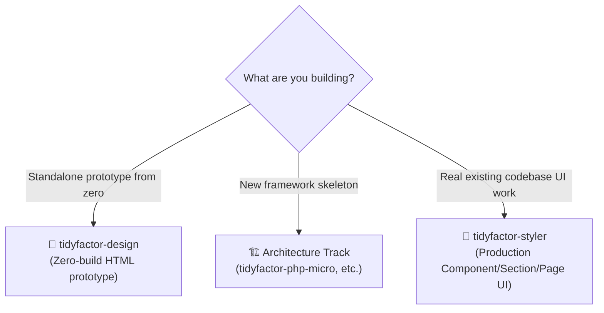
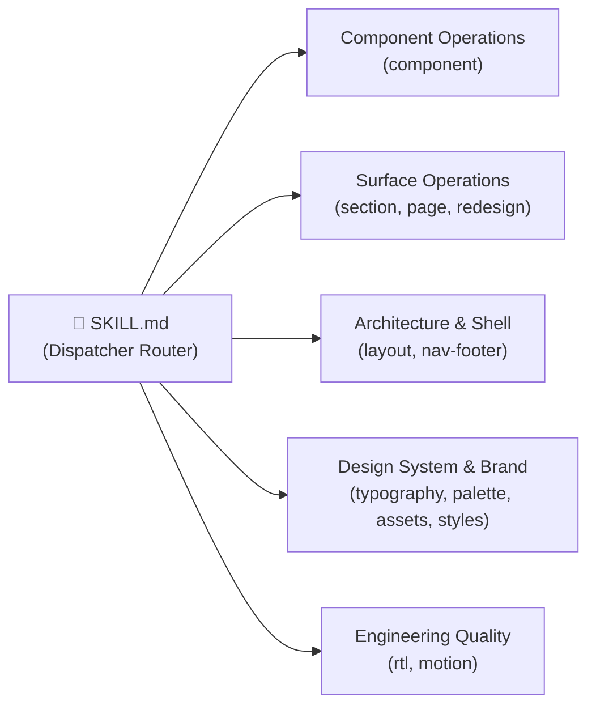

<div align="center">

# 💎 TidyFactor Styler `v1.0.1`
### Production-Stage Visual Design & In-Codebase UI Engineering Suite

**The official production styling & UI transformation skill for the TidyFactor Ecosystem across all modern web frameworks.**

[](https://www.npmjs.com/package/@alwkala/tidyfactor-styler)
[](LICENSE)
[](README.ar.md)
[](#-anti-slop-governance--quality-bar)
[-green.svg?style=for-the-badge)](#-license--governance)

[✨ Ecosystem Hub](https://alwkala.com) • [⚡ 12 Slash Commands](#-command-registry--architecture) • [🛠️ 7 Production Workflows](#%EF%B8%8F-the-7-production-workflows) • [🌐 Supported Stacks](#-supported-production-stacks) • [🇸🇦 Arabic & RTL Engineering](#-native-arabic--rtl-engineering) • [📖 بالعربية](README.ar.md)

</div>

---

> [!NOTE]
> **TidyFactor Styler** is an opinionated, production-grade AI Agent Skill and UI engineering engine designed for real, live codebases. Unlike standalone prototyping engines, **Styler operates directly inside existing production stacks** (*React/Next.js App Router, PHP Flight/Medoo, WordPress blocks, or vanilla HTML/CSS/JS*) without introducing duplicate style layers, alien dependencies, or per-page CSS drift.

---

## 🌟 Value Proposition: When to Use Styler?



| For Frontend Developers | For Fullstack & Agency Teams | For AI Coding Agents |
|---|---|---|
| **Conform, Don't Compete**: Adopts your existing naming, Tailwind config, and styling conventions without creating a parallel CSS system. | **Full Stack Agnostic**: Seamlessly switches between Next.js, PHP, WordPress, and Vanilla stacks with zero manual prompt calibration. | **Token-Efficient Dispatcher**: Lightweight `SKILL.md` entry router loads only ~350 tokens at launch, pulling memory only when required. |
| **Component-Scoped Precision**: Component redesigns touch only the component definition and its immediate usages — never neighboring widgets. | **Arabic / RTL First-Class**: Automated logical CSS properties (`ms-*`, `pe-*`, `start-*`), letterform-aware font scaling, and bidi isolation. | **Anti-Slop Certified**: 6-axis pre-emit self-critique (P, H, E, S, R, V) blocks generic AI purple gradients and sloppy styling tells. |
| **8-State Interaction Matrix**: Guarantees default, hover, active, focus, disabled, loading, empty, and error states for all components. | **Brand SSOT Integration**: Automatically reads `brand.json` and maps design tokens to native CSS custom properties or framework theme vars. | **Deterministic Checklists**: Every workflow terminates with an explicit, quantifiable validation checklist before shipping. |

---

## ⚡ Command Registry & Architecture

`tidyfactor-styler` exposes **12 precision slash commands** organized into a modular dispatch architecture:



| Command | User Intent | What It Loads | Output & Value |
|---|---|---|---|
| `component` | "Create / Redesign this component" | `workflows/component-create.md` or `component-redesign.md` + `component-anatomy.md` + `stacks/*.md` | Production React/PHP/HTML component with 8-state coverage & CVA variants. |
| `section` | "Create / Restyle this section" | `workflows/section-create.md` or `section-redesign.md` + `layout-archetypes.md` + `nav-footer-catalog.md` | Scoped section surface with responsive rhythm and clean visual hierarchy. |
| `page` | "Build a new production page" | `workflows/page-create.md` + `layout-archetypes.md` + `nav-footer-catalog.md` + `stacks/*.md` | Complete page assembly strictly adhering to framework file conventions. |
| `redesign` | "Redesign this existing page" | `workflows/page-redesign.md` + `layout-archetypes.md` + `nav-footer-catalog.md` + `quality-bar.md` | High-impact visual overhaul with zero functional regression or broken state. |
| `layout` | "Select layout archetype / macrostructure" | `memory/layout-archetypes.md` + `stacks/*.md` | Matches product context to 1 of 8 macrostructure archetypes (`editorial`, `interface`, etc.). |
| `nav-footer` | "Select navigation & footer archetypes" | `memory/nav-footer-catalog.md` + `typography-arabic.md` + `rtl-css-engineering.md` | Chooses from N1–N9 navigation and Ft1–Ft8 footer archetypes with RTL alignment. |
| `typography` | "Pick/pair typography, incl. Arabic" | `memory/typography-arabic.md` | Applies 7 mood-routed font pairings (Cairo, Tajawal, El Messiri, Inter, Outfit). |
| `palette` | "Extract color palette & WCAG AA contrast" | `memory/brand-tokens.md` + `memory/asset-tooling.md` | Generates semantic token scales with automated WCAG 2.1 AA contrast scores. |
| `assets` | "Asset hygiene & image optimization" | `memory/asset-tooling.md` + `memory/quality-bar.md` | Compresses images, inspects dimensions, and removes backgrounds via Python tooling. |
| `rtl` | "Audit & fix RTL / Arabic correctness" | `workflows/rtl-audit-fix.md` + `memory/rtl-css-engineering.md` | Converts directional CSS to logical properties and fixes icon flipping rules. |
| `motion` | "Add / review motion and interaction" | `memory/motion-principles.md` | Orchestrates Framer Motion / Alpine transitions with `prefers-reduced-motion` a11y. |
| `styles` | "Choose a design direction / style movement" | `memory/design-styles.md` | Directs UI to a specific aesthetic movement (Modern SaaS, Editorial, Swiss, etc.). |

---

## 🛠️ The 7 Production Workflows

Every task follows a strict, single-outcome workflow ending in an automated validation checklist:

1. **`component-create.md`**: Step 0 Design Read $\rightarrow$ Variant & State Mapping $\rightarrow$ Stack-Native Implementation $\rightarrow$ Pre-Emit Critique $\rightarrow$ Verification.
2. **`component-redesign.md`**: Current State Audit $\rightarrow$ Intent & Direction Selection $\rightarrow$ Scoped Refactoring $\rightarrow$ Zero Regression Check.
3. **`section-create.md`**: Macrostructure Alignment $\rightarrow$ Layout Archetype Rhythm $\rightarrow$ Inner Component Composition $\rightarrow$ Responsive Polish.
4. **`section-redesign.md`**: Section Scope Isolation $\rightarrow$ Hierarchy Elevation $\rightarrow$ Visual Anchor Refresh $\rightarrow$ Mobile Grid Audit.
5. **`page-create.md`**: Page Archetype Blueprint $\rightarrow$ Nav/Footer Selection $\rightarrow$ Section Assembly $\rightarrow$ SEO & Metadata Injection.
6. **`page-redesign.md`**: Global Visual Cohesion $\rightarrow$ Conversion Path Optimization $\rightarrow$ Typography Harmony $\rightarrow$ Performance Budget.
7. **`rtl-audit-fix.md`**: Directional CSS Elimination $\rightarrow$ Logical Properties Refactor $\rightarrow$ Bi-directional Icon Inversion $\rightarrow$ Font Hierarchy Tuning.

---

## 🌐 Supported Production Stacks

`tidyfactor-styler` inspects your codebase and binds dynamically to your target stack's architecture:

| Target Framework | Styling Foundation | Component Architecture | Motion Engine |
|---|---|---|---|
| **React / Next.js** (App Router & Pages) | Tailwind CSS v4 / v3 or CSS Modules | Radix UI / shadcn/ui + CVA + `clsx` + `tailwind-merge` | Framer Motion (`framer-motion`) |
| **PHP (TidyFactor / Flight / Medoo)** | Tailwind CSS or Native CSS Custom Properties | Semantic HTML5 Partials (Plates / Blade / PHP Views) | Alpine.js (`x-transition`) or CSS Transitions |
| **WordPress / Classic CMS** | Modern Theme CSS / Gutenberg Styles | PHP Template Parts / Block Markup | Native CSS Keyframes / Vanilla JS |
| **Static HTML / CSS / JS** | Semantic CSS / Modern CSS Variables | Modular Component Blocks | Vanilla JS / CSS Transitions |

---

## 🇸🇦 Native Arabic & RTL Engineering

Built by native Arabic design engineers, `tidyfactor-styler` treats Arabic as a first-class citizen, never as an afterthought:

- **Logical Properties Standard**: 100% replacement of directional CSS (`left`, `right`, `pl-*`, `mr-*`) with logical counterparts (`inline-start`, `inline-end`, `ps-*`, `pe-*`, `ms-*`, `me-*`).
- **Letterform-Aware Typography**: Strict enforcement of typography rules—Arabic headings use **El Messiri / Cairo / Rooyin**, body copy uses **Tajawal / Cairo / Inter**. Amiri is strictly blocked for headings above 24px.
- **Line-Height Multiplier**: Arabic copy automatically receives $\ge 1.5\times$ line-height to prevent ascender and descender clipping.
- **Bi-directional Iconography**: Directional icons (arrows, chevrons, pagination) mirror automatically in RTL, while non-directional media icons (play, audio, camera) remain un-flipped.

---

## 🛡️ Anti-Slop Governance & Quality Bar

To prevent generic, repetitive "AI-generated" UI artifacts, every output must satisfy the **6-Axis Pre-Emit Self-Critique**:

```
[Pre-Emit Self-Critique]
P (Purpose):       Is this component solving the specific domain goal? (1-5)
H (Hierarchy):     Is there one obvious visual anchor with distinct levels? (1-5)
E (Execution):     Are all 8 interactive states explicitly implemented? (1-5)
S (Stack Native):  Does it match project naming, Tailwind config, and types? (1-5)
R (RTL Ready):     Are all spacing, padding, and icons direction-agnostic? (1-5)
V (Visual Soul):   Does it avoid generic purple hero gradients and generic AI tells? (1-5)
Overall Score: Must be ≥ 25/30 before code emission.
```

---

## 🚀 Installation & Usage

### 1. Add Skill to Your Repository via NPX

```bash
# Install tidyfactor-styler into your current workspace
npx @alwkala/tidyfactor-styler add-skill
```

### 2. Manual Copy into AI Agent Workspace

Copy the `tidyfactor-styler` folder directly into your workspace agent directory:
- **Google Antigravity:** `.agents/skills/tidyfactor-styler/`
- **Claude Code:** `.claude-skill/skills/tidyfactor-styler/`
- **Cursor / Windsurf / Codex:** `.agents/skills/tidyfactor-styler/`

---

## 🏛️ TidyFactor Skill Methodology & 8/8 Governance

`tidyfactor-styler` achieves **100% Compliance (8/8 Pass)** under the **TidyFactor Skill Architect Specification**:

1. ✅ **Dispatcher Discipline**: Lightweight `SKILL.md` routing table (~350 tokens).
2. ✅ **One Workflow = One Outcome**: 7 deterministic workflows with validation checklists.
3. ✅ **Operational Memory**: Zero narrative prose; pure actionable technical matrices.
4. ✅ **No Empty Structures**: Zero empty placeholder folders.
5. ✅ **Philosophy Isolation**: Technical execution separated from brand rationales.
6. ✅ **Trigger-Justified Growth**: Modular files added strictly per verified triggers.
7. ✅ **Anti-Slop Quality Bar**: Mandatory 6-axis pre-emit critique and 16 quality rules.
8. ✅ **Cross-Platform Parity**: Identical execution across Antigravity, Claude Code, Cursor, and Codex.

---


---

## 🏛️ TidyFactor Ecosystem Architecture

**TidyFactor** is a modular web architecture and AI coding agent skill ecosystem built on clear separation of concerns across the product lifecycle:

```
TidyFactor Organization (github.com/TidyFactor)
│
├── Design Skills
│   ├── Cinematic    → Experience / "Wow"     (Apple × Cartier Scroll-Driven Landing Pages)
│   ├── Design       → Prototype / "Build"    (Code-Native UI Design Engine & Figma Alternative)
│   └── Styler       → Production / "Ship"    (Framework Styler & RTL Polish Engine)
│
├── Development Skills
│   ├── HTML         → Content & Static       (Semantic SEO & Static Platform Starter)
│   ├── HTMX         → Hypermedia             (Server-Driven Micro-Interactions)
│   ├── JS           → Vanilla SPA            (Framework-Free Reactive ES Modules)
│   ├── PHP          → Server-Rendered        (Modern PHP 8.x Component UI & Architecture)
│   └── Next         → Multi-Tenant SaaS      (Next.js 16, React 19, Supabase RLS & Dev-Perf)
│
└── Growth Skills
    └── Marketing    → Growth / Revenue       (Direct Response, Pillar SEO & Content Lifecycles)
```

### 💎 Frontend Triad

```
                TidyFactor
                    │
          ┌─────────┼─────────┐
          │         │         │
      Cinematic   Design    Styler
          │         │         │
      Experience Prototype Production
          │         │         │
       "Wow"      "Build"   "Ship"
```

### 📦 Community Package & Skill Parity

| Track | Category | GitHub Repository | Agent Skill | NPM Package |
| :--- | :--- | :--- | :--- | :--- |
| **Cinematic** | Design | [`TidyFactor/Cinematic`](https://github.com/TidyFactor/Cinematic) | `tidyfactor-cinematic` | [`@alwkala/create-cinematic-kit`](https://www.npmjs.com/package/@alwkala/create-cinematic-kit) |
| **Design** | Design | [`TidyFactor/Design`](https://github.com/TidyFactor/Design) | `tidyfactor-design` | [`@alwkala/tidyfactor-design`](https://www.npmjs.com/package/@alwkala/tidyfactor-design) |
| **Styler** | Design | [`TidyFactor/Styler`](https://github.com/TidyFactor/Styler) | `tidyfactor-styler` | [`@alwkala/tidyfactor-styler`](https://www.npmjs.com/package/@alwkala/tidyfactor-styler) |
| **Next** | Development | [`TidyFactor/Next`](https://github.com/TidyFactor/Next) | `tidyfactor-next` | [`@alwkala/tidyfactor-next`](https://www.npmjs.com/package/@alwkala/tidyfactor-next) |
| **HTML** | Development | [`TidyFactor/HTML`](https://github.com/TidyFactor/HTML) | `tidyfactor-html` | [`@alwkala/tidyfactor-html`](https://www.npmjs.com/package/@alwkala/tidyfactor-html) |
| **HTMX** | Development | [`TidyFactor/HTMX`](https://github.com/TidyFactor/HTMX) | `tidyfactor-htmx` | [`@alwkala/tidyfactor-htmx`](https://www.npmjs.com/package/@alwkala/tidyfactor-htmx) |
| **JS** | Development | [`TidyFactor/JS`](https://github.com/TidyFactor/JS) | `tidyfactor-js` | [`@alwkala/tidyfactor-js`](https://www.npmjs.com/package/@alwkala/tidyfactor-js) |
| **PHP** | Development | [`TidyFactor/PHP`](https://github.com/TidyFactor/PHP) | `tidyfactor-php` | [`@alwkala/tidyfactor-php`](https://www.npmjs.com/package/@alwkala/tidyfactor-php) |
| **Marketing** | Growth | [`TidyFactor/Marketing`](https://github.com/TidyFactor/Marketing) | `tidyfactor-marketing` | [`@alwkala/tidyfactor-marketing`](https://www.npmjs.com/package/@alwkala/tidyfactor-marketing) |

---

## 👨‍💻 Organization & Support

- 🌐 **Official Website:** [https://tidyfactor.com/](https://tidyfactor.com/)
- 📚 **Official Documentation:** [https://tidyfactor.com/documentation](https://tidyfactor.com/documentation)
- 🤝 **Official Partner Website:** [Alwkala Digital Agency](https://alwkala.com/)
- 🐙 **GitHub Organization:** [github.com/TidyFactor](https://github.com/TidyFactor)
- 📧 **Business Inquiries:** [hello@tidyfactor.com](mailto:hello@tidyfactor.com)
- 📱 **WhatsApp:** [+20 101 665 6899](https://wa.me/201016656899)
- 📞 **Phone:** +20 101 665 6899
- 📍 **Location:** Cairo, Egypt

---

## 📜 License

Licensed under the **Apache License 2.0**. Copyright (c) 2026 [TidyFactor](https://tidyfactor.com) & [Alwkala](https://alwkala.com).
